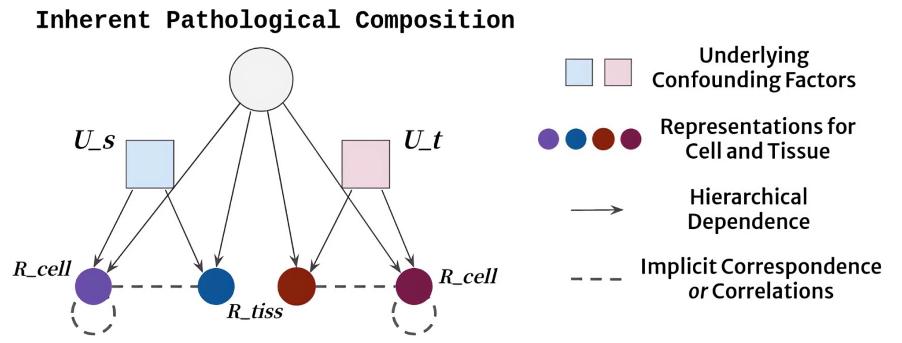

# Revisiting Adaptive Cellular Recognition Under Domain Shifts: A Contextual Correspondence View (ECCV 2024)

## 💡 Highlights
In this work, we identify the importance of implicit correspondences across biological contexts for exploiting domain-invariant pathological composition and thereby propose to exploit the dependence over various biological structures for domain adaptive cellular recognition.

## Environment Setup
This project is based upon the MaskRCNN-benchmark repository(https://github.com/facebookresearch/maskrcnn-benchmark). 
For environment installation and setup, please refer to this page and follow the instructions.

## Training

    bash train_class.sh

## Evaluation

    cd inference/PanNuke_aug/
    python PanNuke_cross_classonly_infer.py
    python PanNuke_cross_classonly_eva.py
    

## Acknowledgements
This project is based on [MaskRCNN-benchmark](https://github.com/facebookresearch/maskrcnn-benchmark), [MAE](https://github.com/pengzhiliang/MAE-pytorch), [PDAM](https://github.com/dliu5812/PDAM), thanks for their excellent works.

## License

This project is released under the MIT license. Please see the [LICENSE](LICENSE) file for more information.
